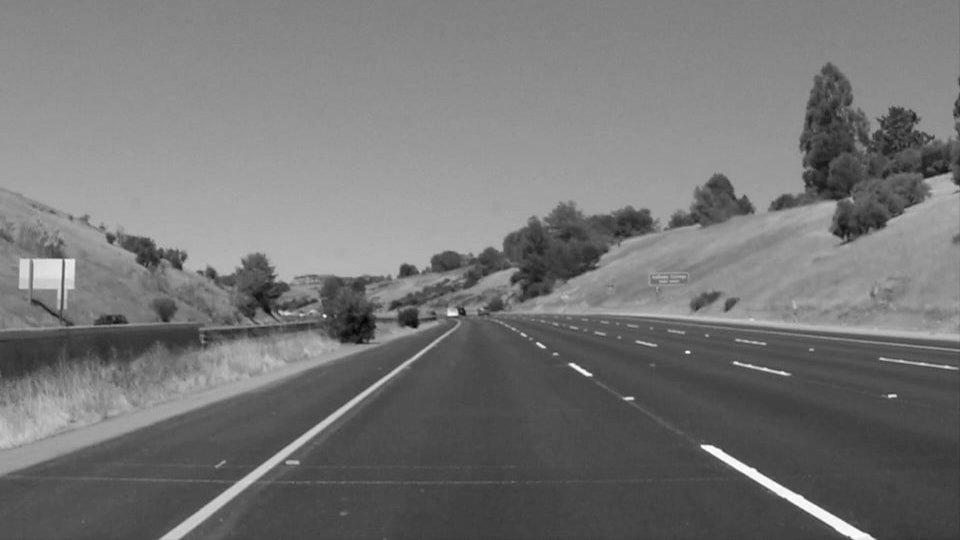

# **Finding Lane Lines on the Road** 

This project belongs to my work towards Udacitys 'Self-Driving Car Engineer' Nanodegree. The general project goal is to detect lane lines in images using Python and OpenCV. A decription of my implementation can be found below the original project decription.
The code is included in the IPython notebook P1.ipynb

The Project
---

The goals / steps of this project are the following:

The goals / steps of this project are the following:
* Make a pipeline that finds lane lines on the road
* Reflect on your work in a written report
---

### Reflection

### 1. Description of the image processing pipeline. 

The pipeline consists of 5 steps to detect lane markings in an original image (cf. Fig. 1). 

<figure>
 
 <figcaption>
 

 
 
 Fig. 1: original image 
 
 </figcaption>
</figure>
 

 

First, the images are converted to grayscale (cf. Fig. 2), then edges are detected with a canny edge detection (params: low_thresh=70, high_thresh=240) (cf. Fig. 3)

<figure>
 
 <figcaption>
 

 
 
 Fig. 2: grayscale image 
 
 </figcaption>
</figure>
 

 
 <figure>
 
 <figcaption>
 

 
 
 Fig. 3: edges detected with canny algorithm 
 
 </figcaption>
</figure>
 

 

Afterwards, only lines within the region of interest ([[(580, 340), (420, 340), (140, 540), (900, 540)]]) are selected (cf. Fig. 4).

<figure>
 
 <figcaption>
 

 
 
 Fig. 4: edges within the region of interest 
 
 </figcaption>
</figure>
 

In order creat smoother and also longer line segments a gaussian blurring (kernel size=3) is applied to the edge image (cf. Fig. 5).

<figure>
 
 <figcaption>
 

 
 
 Fig. 5: blurred edges within the region of interest 
 
 </figcaption>
</figure>
 

 
Afterwards, the created edges are tranformed to hough space (rho=2, theta=3*(np.pi/180), threshold=30, min_line_len=20, max_line_gap=4), where the longest line belonging to the left and right marking respectively is determined (cf. Fig. 6). Afterwards, the determined lines are exctended up to the lower edge of the picture and the upper border of the region of interest (or in the special case of intersection lines up to the intersection point). In addition, the lateral extend of the markings is estimated and the entire constructed marking is drawn.

To do so, the original draw_lines() function was modified as follows:
* the actual calculation of the lines was moved to a seperate function (calc_lines()) in order to be accesible from another function draw_markigns() as well
* the calc_lines() function expects the image and the hough lines as input and determines the longest line belonging to the left and right border respectively and returns it
* the draw_markings() and hough_markings() functions were defined - they draw the markings as polygons instead as lines

<figure>
 
 <figcaption>
 

 
 
 Fig. 6: extended longest line belonging to the left and right marking (red); estimated outer borders of the markings (blue) 
 
 </figcaption>
</figure>
 

Back in the original image, the constructed lines can be shown as overlay (cf. Fig. 7).

<figure>
 
 <figcaption>
 

 
 
 Fig. 7: original image overlayed with estimated lane markings as lines 
 
 </figcaption>
</figure>
 

The constructed lines are converted to a polygon spanning over the full extend of the markings (cf. Fig. 8).

<figure>
 
 <figcaption>
 

 
 
 Fig. 8: original image overlayed with estimated lane markings as polygons 
 
 </figcaption>
</figure>
 

### 2. Shortcomings with the current pipeline

The current pipeline shows some minor shortcomings:

* The detection of dashed lines is not as stable as the one of solid lines. The reasons is that the approach uses the longest line as reference and as the car is moving along the dashed line, the reference is continously changing.
* The approach uses the longest line as reference and extends it with a small amount of pixels to the left and to the right. But as it is not known, wether the current line belongs to the right or left border of the considered marking it is not clear, into which direction, the line should be extended more than to the other. In some rarely occuring situations, this also leads to instabilities.
* In the challenging example, it is hard to detect lines in the shadowed region. In addition, the road rather curvy - therefore, it is a bad idea to estimate the the markings with single lines.

### 3. Possible improvements to the pipeline
The described shortcoming could be fixed as follows:

* In order to create smoother lane markings, a smoothing over consecutive pictures of the video stream could be applied.
* To get better line approximation in shadowed regions, the parameters could be tuned further or other color spaces could be tried out.
* For curvy roads, for exaymple, a polynom of third order could be used to approximate the lane markings.

